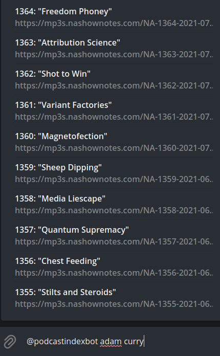

# PodcastIndex Bot
This bot uses API of [podcastindex.org](podcastindex.org) to process inline queries and search for desired podcast, and show episodes from it. In the results, it shows an episode title, starting from latest episode on top, and mp3 episode url. If you choose to click on the title, bot will send a message, which will contain podcast title, description and a url-button with link to mp3. At the same time, if the episode is smaller than 20MB, the bot will send the podcast as mp3 directly to the telegram, instead of the message described previously.

### Example:

